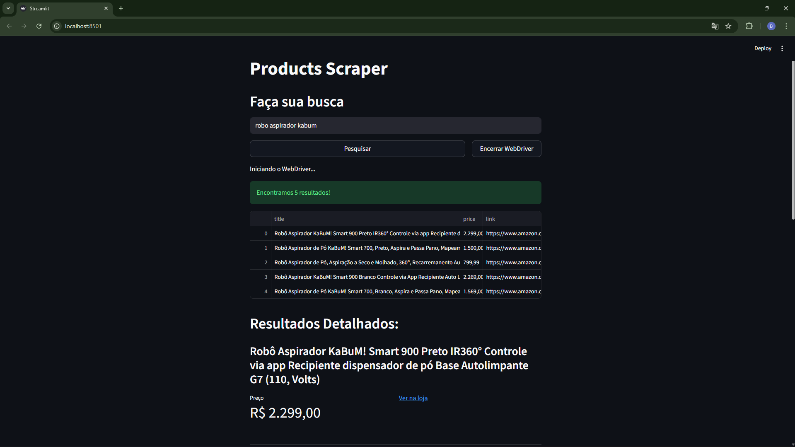

# Bot Comparador de Preços

Esta é uma aplicação web interativa, construída com Streamlit, que utiliza um bot de automação (Selenium) para buscar e comparar preços de produtos. A ferramenta não apenas realiza buscas em tempo real, mas também **salva um histórico de todas as buscas**, criando uma base de dados valiosa para futuras análises de variação de preços.

## Visualização

## Funcionalidades

- **Persistência de Dados Históricos:** Cada busca realizada é salva com um timestamp em uma planilha (`.csv`), criando um dataset para análises futuras de variação de preço.
- **Navegação com Menu Lateral:** A interface agora conta com um menu de navegação (utilizando `streamlit-option-menu`), preparando a aplicação para futuras seções como um dashboard de visualização de dados.
- **Interface Web Interativa:** Uma interface amigável construída com Streamlit que permite ao usuário interagir diretamente com o bot.
- **Busca em Tempo Real:** O usuário digita o produto desejado e o bot inicia o processo de scraping no momento do clique.
- **Controle do Navegador:** Botões para iniciar e encerrar a sessão do navegador de forma explícita, permitindo múltiplas buscas de forma eficiente.
- **Visualização Clara dos Resultados:** Os dados extraídos são exibidos em uma tabela interativa e em formato de "cards" para melhor leitura.

## 🛠️ Tecnologias Utilizadas

- **Python 3**
- **Streamlit:** Para a criação da interface web interativa.
- **Streamlit Option Menu:** Para a criação do menu de navegação lateral.
- **Selenium:** Para a automação e controle do navegador web (backend).
- **Pandas:** Para a manipulação, estruturação e salvamento dos dados.
