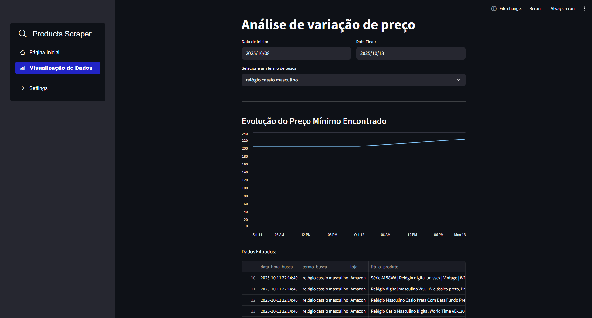

# Bot Comparador de Preços

Esta é uma aplicação web completa, construída com Python e Streamlit, que automatiza a coleta de preços de produtos e oferece um dashboard interativo para analisar a sua evolução histórica.

## Visualização

## Funcionalidades

- **Dashboard de Análise Histórica:** Visualize a variação de preços de qualquer produto monitorado em um gráfico de linha interativo.
- **Filtros Dinâmicos:** Filtre os dados a serem analisados por termo de busca e por um período de data (início e fim) para focar em insights específicos.
- **Agregação Inteligente de Dados:** Utiliza \`pandas.resample\` para agrupar os dados por dia, mostrando a evolução do preço médio ou mínimo de forma clara e precisa.
- **Limpeza Automática de Dados:** Garante a consistência dos dados, tratando valores ausentes no gráfico (\`.ffill()\`) e limpando os termos de busca (\`.strip()\`) para evitar duplicatas.
- **Coleta de Dados em Segundo Plano:** O bot com Selenium opera de forma robusta para extrair título, preço e link dos produtos.
- **Persistência de Dados:** Todas as buscas são salvas em um arquivo \`.csv\`, construindo um valioso histórico de preços ao longo do tempo.

## 🛠️ Tecnologias Utilizadas

- **Python 3**
- **Streamlit:** Para a criação da interface web interativa.
- **Streamlit Option Menu:** Para a criação do menu de navegação lateral.
- **Selenium:** Para a automação e controle do navegador web (backend).
- **Pandas:** Para a manipulação, estruturação e salvamento dos dados.
